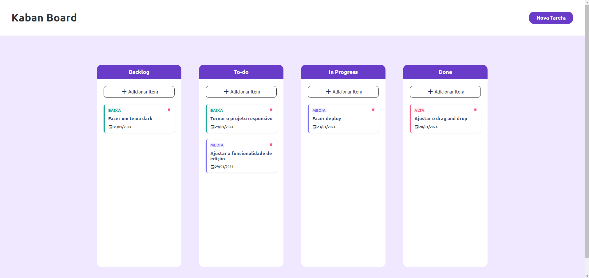
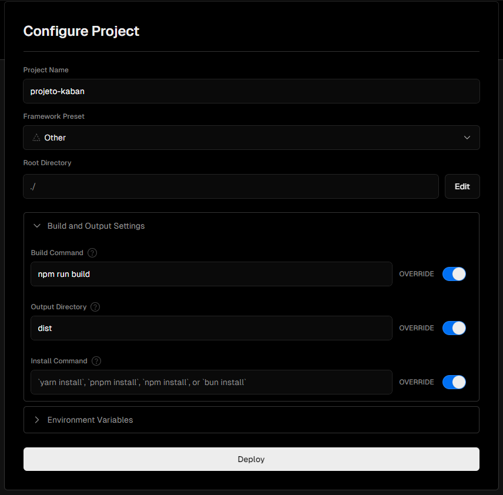

<h1 align="center"> Kaban </h1>

 

  

## 🚀 Tecnologias

Esse projeto foi desenvolvido com as seguintes tecnologias:

- HTML
- CSS
- Less
- Javascript
- npm
- Grunt
- Git e Github

## 💻 Projeto

Este projeto foi feito durante meus estudos sobre Javascript

## ⚡ Configuração na Versel

  

- [Visite o projeto online](https://projeto-kaban.vercel.app/)